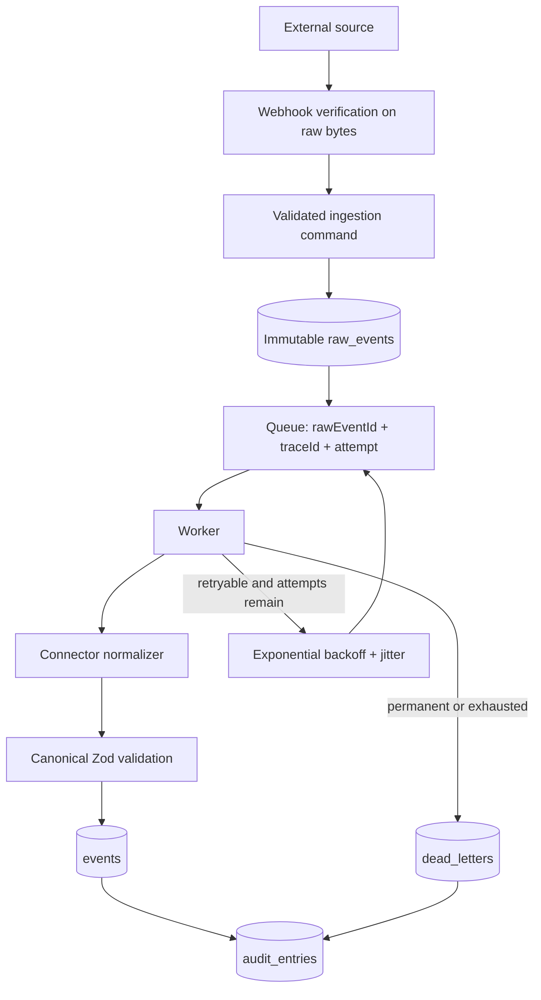

# Event flow

## Acceptance

The API creates a trace ID, validates the command, verifies the exact raw bytes through a provider-specific abstraction, stores an immutable raw fact under database uniqueness constraints, and enqueues only a newly inserted record. It does not normalize synchronously.

If enqueue fails after raw persistence, the source fact is not lost. M0 surfaces the request failure and leaves the raw row recoverable; a later milestone should add a transactional dispatch marker and reconciler before production traffic.

## Processing

The worker retrieves the raw event from the event store, not the queue payload. It opens a processing run, selects a connector by source, validates every canonical result, persists idempotently, writes audit, marks success, and acknowledges delivery.

Retryable typed errors produce a failed run and a bounded delayed retry with an incremented attempt. Permanent errors and exhausted retries create a dead letter and are acknowledged. Postgres queue locks expire after five minutes so a crashed worker cannot hold work forever.

## Ordering and replay

`occurredAt` and `receivedAt` remain separate because arrival order cannot be trusted. A replay creates new processing history but deterministic canonical identity and database uniqueness prevent duplicate facts.
