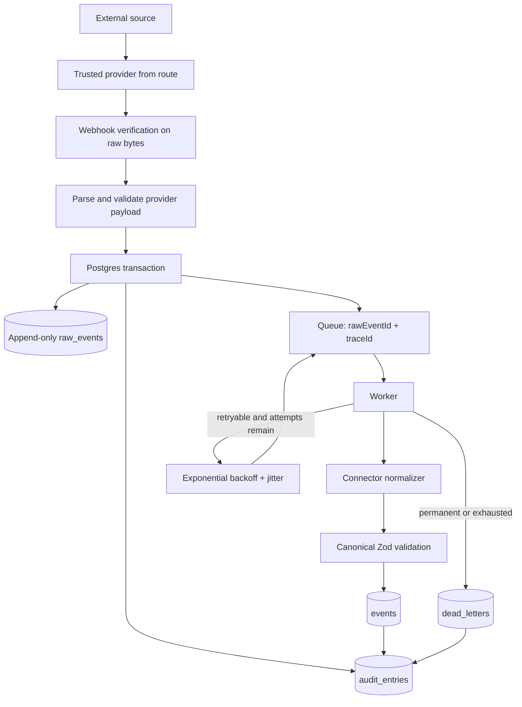

# Event flow

## Acceptance

For production provider routes, the API creates a trace ID, derives the provider from trusted routing context, verifies the exact raw bytes, and only then parses provider-specific content. The convenient `/v1/events/ingest` schema-first endpoint is development-only and is not registered in production.

In PostgreSQL mode, `raw_events`, `event_queue`, and the ingestion audit entry are written through one pool client and one transaction. Any failure rolls back all three. A duplicate request inspects canonical, successful-processing, permanent-dead-letter, and active-queue state; it restores queue work only when processing is still incomplete. A unique queue constraint prevents two active rows. The worker also runs an idempotent reconciler at startup and every minute for raw rows older than two minutes.

## Processing

The worker retrieves the raw event from the event store, not the queue payload. It opens a processing run, selects a connector by source, validates every canonical result, persists idempotently, writes audit, marks success, and acknowledges delivery.

Every Postgres lease generates a new `lease_token` and atomically increments database-owned `delivery_count`. `ProcessingRun.attempt` equals that count. ACK and retry require both queue ID and the current token; a stale worker receives `stale` and cannot mutate a newer lease. Locks expire after five minutes. Work that repeatedly loses its lease is dead-lettered at the configured delivery limit, so hard crashes cannot create an infinite attempt-one loop.

## Ordering and replay

`occurredAt` and `receivedAt` remain separate because arrival order cannot be trusted. Every canonical event has a stable connector-defined `deduplicationKey`; the database enforces uniqueness of `(raw_event_id, deduplication_key)`. The shared canonical-ID helper keeps IDs deterministic while the independent constraint protects replay even if a connector supplies another ID.
